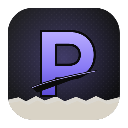

<p align="center">
  
</p>

<h1 align="center">Perseverance</h1>
<p align="center"><b>A Photoshop-style desktop editor built for stylized Roblox thumbnails, icons & GFX.</b></p>

Perseverance gives you a familiar pro editor (layers, masks, blend modes, layer styles,
adjustments, selections, brushes, text) plus everything specific to Roblox GFX in one place:
generated paper/grunge/smoke/halftone assets, one-click looks, Roblox safe zones and previews,
a 3D **Pose Studio** for blocky avatars, background removal for avatar renders, and templates
for the classic gothic-poster, sunburst-halftone, noir-newspaper and crimson-film styles.

It runs fully **offline**: fonts and assets are bundled or generated, and nothing is uploaded.

---

## Install

Installers are built by GitHub Actions (*Build installers*, `.github/workflows/release.yml`):

- **Releases** — [github.com/noxiryn/perseverance/releases](https://github.com/noxiryn/perseverance/releases).
  Each version tag (e.g. `v0.1.0`) publishes the Windows installer + portable `.exe`, the macOS
  `.dmg` and the Linux `.AppImage` there, and no GitHub account is needed to download them
  while the repository is public. (If the
  page is still empty, no version has been tagged yet — use the next option.)
- **Latest build** — every push builds the Windows installer: **Actions** tab → *Build installers*
  → the newest run with a green check → *Artifacts* → **`perseverance-Windows`**. You must be signed
  in to GitHub; it downloads as a `.zip` holding `Perseverance-Setup-<version>.exe` and
  `Perseverance-Portable-<version>.exe`, and expires after 90 days.

### Windows
1. Get **`Perseverance-Setup-<version>.exe`** (from a Release, or unzipped from the artifact).
2. Run it and pick an install folder. You get Start Menu and Desktop shortcuts, and `.pgfx`
   projects open in Perseverance when you double-click them.
3. The installer isn't code-signed, so Windows SmartScreen may say *"Windows protected your PC"*.
   Click **More info → Run anyway**.

Prefer no installer? Run **`Perseverance-Portable-<version>.exe`** directly. It doesn't register
the `.pgfx` file type (double-clicking projects won't open them); use **File → Open…** instead.

### macOS / Linux (tagged releases)
- macOS: open the `.dmg` and drag Perseverance into Applications. It isn't notarized, so the first
  launch is blocked: on macOS 15 Sequoia and later open **System Settings → Privacy & Security**,
  scroll to the message about Perseverance and click **Open Anyway** (on macOS 14 and older,
  Control-click the app → **Open**).
- Linux: `chmod +x Perseverance-<version>.AppImage` and run it. AppImages need FUSE 2; on Ubuntu
  22.04 and later install it with `sudo apt install libfuse2` (or run the AppImage with
  `--appimage-extract-and-run`).

**New here?** Open **Help → Make Your First Roblox Thumbnail…** (or click **Make a Roblox
thumbnail** on the start screen): it walks you from a template to your own character to the
exported thumbnail.

### Sharing it with friends
The simplest way is to send them the **`Perseverance-Setup-<version>.exe`** file itself (chat,
email, a USB stick or a cloud drive): it's a standalone installer with nothing else to download.
Once a version has been published on the [Releases page](https://github.com/noxiryn/perseverance/releases),
that link works too and needs no GitHub account — open it first to check it lists the installer
(it stays empty until the first version tag is pushed). Actions artifacts are a poor fit for
sharing: they need a GitHub login, come zipped and expire.

Projects save as **`.pgfx`** files that open in any copy of Perseverance:
- Bundled fonts work everywhere, and fonts you added with **Type → Add Font File…** are embedded
  in the project, so the text looks the same on your friend's computer.
- **System fonts** (the ones installed in Windows/macOS) are **not** embedded. If your friend
  doesn't have one, Perseverance names the missing fonts when the project opens and the text uses
  a fallback font until they install it (or add the font file with Type → Add Font File…).

---

## What's inside

| Area | Highlights |
|---|---|
| **Editor** | Photoshop-like workspace: menus, tool options bar, tools panel with flyouts, document tabs, dockable panels (Navigator, Libraries, Swatches, Color, Looks, Layers, Properties, History, Adjustments, Effects, Character, Brushes, Fonts, Character Styler), command search (Ctrl K), workspaces |
| **Layers** | Raster, text, shape, fill, adjustment and group layers · 16 blend modes · opacity and fill · layer masks · clipping masks · smart (non-destructive) filters · undo history |
| **Layer styles** | Drop shadow, outer/inner glow, stroke, long shadow, inner shadow, color/gradient/pattern overlay, bevel, style presets that adapt to the layer colour · save your own (My Styles, incl. smart filters), copy/paste smart filters |
| **Adjustments** | Brightness/contrast, levels, curves, exposure, vibrance, hue/saturation, color balance, black & white, photo filter, channel mixer, gradient map, selective color, posterize, threshold, duotone, split toning, color looks |
| **Filters** | Halftone, cel-shade, cutout, ink outline, dither, risograph, chromatic aberration, glitch, VHS, rough edges, blurs, distortions, grain, bloom, light rays, vignette and many more, with a live-preview Filter Gallery |
| **Assets** | Generated, tweakable textures and overlays: paper, grunge, torn borders, gothic tendrils, newspaper clippings, smoke, film scratches, fold creases, sunbursts, speed lines, halftone screens, sparks, bokeh, splatter… plus your own imported images |
| **Text** | ~85 bundled fonts (blackletter, condensed, script/signature, horror, Japanese, cartoon) + your system fonts · warp text · character styles |
| **Roblox** | Pose Studio (R6/R15 rig, poses, hair/accessories, toon shading, outlines, rim lights) · Import 3D Model (OBJ/GLB/FBX from Roblox Studio) · Fetch Roblox Avatar · Replace Character (swap your render into a template, keeping its styling) · Remove Background · Character Styler · rim-light/top-shade/toon filters · Roblox Safe Zones · Roblox Preview (game cards) |
| **Files** | `.pgfx` projects, PNG/JPG/WebP export with Roblox size presets, PSD import/export, autosave and crash recovery, clipboard paste, drag & drop |

### Making a Roblox thumbnail in a minute
1. **File → New from Template…** and pick a style (or **File → New** → *Roblox Thumbnail*).
2. Swap in your character: with the template's placeholder selected, drop your render on the canvas (or bring
   it in with **File → Place Image…** / **Edit → Paste**) and pick **Replace Placeholder Character** — or use
   **Roblox → Replace Character…** (file or clipboard). Your render takes the placeholder's spot, size, filters
   and effects; an opaque background is removed automatically when that can be done reliably (otherwise the
   toast points you to **Roblox → Remove Background…**).
   No render yet? **Roblox → Pose Studio…** or **Roblox → Fetch Roblox Avatar…** fill the placeholder too.
3. Starting from a blank canvas instead? Drop the render, run **Roblox → Remove Background…**, then choose a
   style in the **Character Styler** panel (Roblox → Character Styler).
4. Double-click the title text to edit it, and tweak the **Looks**, **Libraries** and **Effects** panels.
5. **Roblox → Roblox Safe Zones** to check framing, **Roblox → Roblox Preview…** to see it at real size.
6. **File → Export As…** → *Roblox Thumbnail 1920×1080* (or *Roblox Icon 512×512*).
7. Making a series? **File → Save as Template…**, **Looks → Save as Look…** and **Effects → Save Layer Style…**
   keep your work reusable for the next game's thumbnail.

Prefer to be walked through it? Click **Make a Roblox thumbnail** on the start screen (or the
lightbulb in the title bar, or **Help → Make Your First Roblox Thumbnail…**): the guide runs each
step for you and picks up where you left off when you reopen it. The start screen's **Start from
your character** row opens Pose Studio, avatar fetch, 3D model import, or an image straight into
Remove Background.

---

## Build from source

Requires Node.js 22+.

```bash
npm install
npm run app          # run the desktop app in dev mode (Vite + Electron, hot reload)
npm run dev          # or just the editor in a browser at http://localhost:5173
npm run typecheck && npm test
npm run dist:win     # → release/Perseverance-Setup-<version>.exe (+ portable .exe)
npm run dist:mac     # → release/*.dmg    (on macOS)
npm run dist:linux   # → release/*.AppImage
```

Check the real desktop app (Linux with Xvfb): file-access policy, Save As, second instance and file
association forwarding, close guard with a hung or crashed window, window state, CSP and permissions:

```bash
npx vite build && xvfb-run -a -s "-screen 0 1600x960x24" node scripts/electron-desktop-check.mjs
```

Building the Windows installer on Linux needs Wine with 32-bit support:

```bash
sudo dpkg --add-architecture i386 && sudo apt update
sudo apt install -y wine wine32:i386
npm run dist:win
```

**Automatic builds** (`.github/workflows/release.yml`): every push typechecks, tests and builds the
app on Windows and uploads the installers as the `perseverance-Windows` artifact. Pushing a tag
such as `v0.1.0` (or running the workflow manually with *Create a GitHub Release* ticked) builds
Windows, macOS and Linux installers and publishes them as a GitHub Release:

```bash
git tag v0.1.0 && git push origin v0.1.0
```

The Windows installer is required for a Release. If the macOS or Linux build fails, the Release is
still published with the installers that did build, and the failed job stays red in the run. Before
the first tag, run the workflow once by hand (**Actions → Build installers → Run workflow**, with
*Create a GitHub Release* unticked) to check all three builds.

Windows and macOS file systems are case-insensitive, so two source files whose names differ only
in case (e.g. `filterDialog.ts` / `FilterDialog.tsx`) break the Windows build even though Linux
builds pass; `src/core/filenames.test.ts` fails the test run on such clashes. electron-builder's
caches must stay outside the repo (the workflow keeps them in `../eb-cache`): with
`"type": "module"` in package.json its extracted CommonJS helpers fail inside the project.

### Project layout
See [`ARCHITECTURE.md`](ARCHITECTURE.md) for the document model, rendering pipeline, plugin
registries and module map.

```
electron/   main process + secure preload bridge
src/core    document model, bitmaps, color, geometry, noise
src/state   editor store (history) and UI store
src/render  compositor, text/shape rendering, layer styles
src/viewport, src/tools/*   canvas + tools
src/filters adjustments, stylize filters, filter dialogs
src/assets  procedural asset library      src/looks, src/templates  one-click looks & templates
src/roblox  Pose Studio, background removal, safe zones, preview
src/io      projects, export, PSD, clipboard, autosave
src/panels  layers, properties, effects, history, navigator
src/ui      shell (menus, toolbar, dock) and shared controls
```

## License & credits
Fonts are bundled from [Fontsource](https://fontsource.org) under the SIL Open Font License.
3D rendering uses [three.js](https://threejs.org); PSD support uses [ag-psd](https://github.com/Agamnentzar/ag-psd);
icons by [Lucide](https://lucide.dev). Perseverance isn't affiliated with or endorsed by Roblox Corporation.
